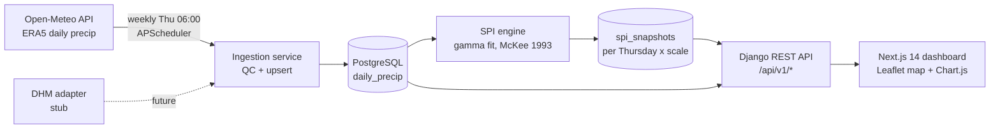

# 🌾 Hamro Khaderi-Lite — Terai Drought Monitor


District-level **SPI (Standardized Precipitation Index)** drought monitoring
dashboard for Nepal's Terai — inspired by DHM's Khaderi Monitoring Tool.
Pilot districts: **Kailali, Bardiya, Kapilvastu**.

> **Prototype** — not an official DHM product. Data: Open-Meteo (ERA5
> reanalysis). For research/education only.

**नेपाली:** यो परियोजना नेपालको तराईका जिल्लाहरूको खडेरी अवस्था अनुगमन गर्ने
प्रोटोटाइप ड्यासबोर्ड हो। प्रत्येक बिहीबार वर्षाको तथ्याङ्क अद्यावधिक गरी
SPI-3, SPI-6 र SPI-12 गणना गरिन्छ, र नक्सा तथा चार्टमा देखाइन्छ। यो DHM को
आधिकारिक उत्पादन होइन — अनुसन्धान र शिक्षाका लागि मात्र।

## Architecture



## Features

- **Weekly pipeline** (Thursdays 06:00 Asia/Kathmandu, APScheduler):
  ingest daily precipitation → QC → compute SPI-3/6/12 → snapshot.
- **SPI engine**: per-calendar-month gamma fit with zero-rain mixture
  (McKee et al. 1993), scipy-based, ±3.5 clamp, degenerate-data guards.
- **Adapter pattern**: `WEATHER_SOURCE=open_meteo|dhm` env switch;
  DHM stub ready for a future official API.
- **REST API** with a uniform `{data, meta, errors}` envelope + Swagger docs.
- **Dashboard**: Leaflet severity map, district list, SPI-3/6/12 Chart.js
  history, bilingual EN/नेपाली toggle.
- **42 pytest tests**, GitHub Actions CI (Postgres service + frontend build).

## Quickstart (local)

```bash
# 1. Backend
cd backend
pip install -r requirements-dev.txt
# PostgreSQL: create user/db khaderi/khaderi/khaderi (or: export USE_SQLITE=1)
python manage.py migrate
python manage.py seed_districts
python manage.py ingest --from 2012-01-01   # ~1 min, real Open-Meteo data
python manage.py compute_spi
python manage.py runserver 0.0.0.0:8000

# 2. Frontend (new terminal)
cd frontend
npm install
npm run dev       # http://localhost:3000
```

Swagger: http://localhost:8000/api/docs/

## Docker

```bash
docker compose up --build
docker compose exec api python manage.py migrate
docker compose exec api python manage.py seed_districts
docker compose exec api python manage.py ingest --from 2012-01-01
docker compose exec api python manage.py compute_spi
# web: http://localhost:3000   api: http://localhost:8000/api/docs/
```

## API

| Method | Path | Description |
|---|---|---|
| GET | `/api/v1/districts/` | List districts |
| GET | `/api/v1/districts/{id}/spi/?scale=3\|6\|12` | Full SPI time series |
| GET | `/api/v1/districts/{id}/current/` | Latest Thursday snapshot (all scales) |
| GET | `/api/v1/map/current/?scale=3` | GeoJSON for the map |
| POST | `/api/v1/ingest/run/` | Trigger pipeline (auth required) |
| GET | `/api/v1/health/` | Health check |

All responses use the envelope `{ "data": ..., "meta": {...}, "errors": [...] }`.

## Data model

- `districts` — name (EN/NE), slug, province, centroid lat/lng
- `daily_precip` — district × date × source, `precip_mm` (NULL = failed QC/missing)
- `spi_snapshots` — district × Thursday × scale, SPI value + severity class
- `ingestion_runs` — audit log (ok/partial/failed, rows upserted/rejected)

## Management commands

```bash
python manage.py seed_districts                 # idempotent district seed
python manage.py ingest --days 14               # recent window (default source)
python manage.py ingest --from 2012-01-01       # full history backfill
python manage.py ingest --district kailali --source open_meteo
python manage.py compute_spi                    # snapshots for last Thursday
python manage.py compute_spi --for 2026-07-16
```

## Deployment

- `deploy/nginx.conf` — reverse proxy (API :8000, web :3000)
- `deploy/ecosystem.config.js` — PM2 for a single VM
- `deploy/Dockerfile.backend` + `deploy/Dockerfile.frontend` + `docker-compose.yml`
- Frontend can also deploy to Vercel (set `NEXT_PUBLIC_API_BASE` to your API URL);
  the Django API needs a Python host (Railway/Fly/EC2/etc.), not Vercel.

## Docs

- [docs/DECISIONS.md](docs/DECISIONS.md) — architecture decision records
- [docs/architecture.md](docs/architecture.md) — component walk-through

## License

MIT (prototype).
