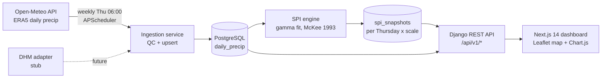

# 🌾 Hamro Khaderi-Lite — Terai Drought Monitor


**Hamro Khaderi-Lite** is a localized, full-stack drought monitoring and early warning dashboard designed specifically for the Terai region of Nepal. By providing clear, science-backed severity indicators, this tool empowers NGOs, local governments, and farmers to make informed decisions regarding agriculture and water resource management.

Pilot districts currently monitored: **Kailali, Bardiya, and Kapilvastu**.

> **🌟 Live Dashboard (Frontend):** [https://frontend-jade-tau-zq7c5shuaq.vercel.app](https://frontend-jade-tau-zq7c5shuaq.vercel.app)
> **⚙️ Live API (Backend):** [https://hamro-khaderi-api.onrender.com/api/v1/health/](https://hamro-khaderi-api.onrender.com/api/v1/health/)

---

## 🎯 Our Mission

Droughts in the Terai region pose a significant threat to Nepal's food security and agricultural livelihoods. **Hamro Khaderi-Lite** addresses this challenge by automating the collection of complex climate data and transforming it into accessible, bilingual (English & नेपाली), and visually intuitive drought severity maps and charts.

Our goal is to bridge the gap between meteorological data and on-the-ground action.

---

## 📊 Data Sources & Methodology

This project adheres to international meteorological standards to ensure the highest data integrity.

### 1. Data Sources
- **[Open-Meteo API](https://open-meteo.com/):** We utilize the highly accurate **ERA5 reanalysis dataset** (provided by the European Centre for Medium-Range Weather Forecasts) for daily historical precipitation data dating back to 2012.
- **DHM Integration Ready:** The system is architected with an adapter pattern, making it fully ready to integrate with the official **Department of Hydrology and Meteorology (DHM), Nepal** API in the future.

### 2. Scientific Methodology
We utilize the **Standardized Precipitation Index (SPI)**, the drought index endorsed by the **World Meteorological Organization (WMO)**.
- **Reference:** *McKee, T.B., Doesken, N.J. and Kleist, J., 1993.* [The relationship of drought frequency and duration to time scales.](https://climate.colostate.edu/pdfs/McKee_et_al_1993.pdf)
- **Calculations:** The system calculates SPI on 3-month (SPI-3), 6-month (SPI-6), and 12-month (SPI-12) timescales using a Gamma distribution fit with zero-rain mixture models to accurately capture both short-term agricultural droughts and long-term hydrological droughts.

---

## 💻 Technical Architecture

The dashboard is powered by a robust, modern technology stack:

- **Frontend:** Built with **Next.js 14**, React, and TailwindCSS for a highly responsive, fast, and accessible user interface. Interactive maps are powered by **Leaflet**, and historical charts by **Chart.js**.
- **Backend:** Built with **Django 5 & Django REST Framework (DRF)**.
- **Database:** **PostgreSQL** is used to store millions of daily precipitation records and computed snapshots securely.
- **Automation:** An integrated **APScheduler** runs a background pipeline every Thursday at 06:00 AM (Asia/Kathmandu) to automatically ingest new weather data, run quality control, and compute the latest SPI values.



---

## 🚀 Quickstart (Local Development)

### 1. Backend (Django API)
```bash
cd backend
pip install -r requirements-dev.txt
export USE_SQLITE=1  # Use SQLite for local testing
python manage.py migrate
python manage.py seed_districts
python manage.py ingest --from 2012-01-01   # Fetches real historical data
python manage.py compute_spi
python manage.py runserver 0.0.0.0:8000
```
*API Documentation (Swagger): [http://localhost:8000/api/docs/](http://localhost:8000/api/docs/)*

### 2. Frontend (Next.js)
```bash
cd frontend
npm install
npm run dev
```
*View the app at: [http://localhost:3000](http://localhost:3000)*

---

## 🌍 Deployment

This project is configured for seamless deployment:
- **Backend Infrastructure-as-Code:** Uses `render.yaml` and `Dockerfile.backend` for instant automated deployment to [Render](https://render.com/).
- **Frontend Platform:** Optimized for edge deployment on [Vercel](https://vercel.com/) by connecting the `NEXT_PUBLIC_API_BASE` environment variable to the live Django API.
- **Auto-Seeding:** The backend Dockerfile is configured to automatically run data ingestion on startup, ensuring the database is always populated even on ephemeral platforms.

---

## 📚 Documentation & References

- [World Meteorological Organization (WMO) SPI Guidelines](https://public.wmo.int/en)
- [Open-Meteo Historical Weather Documentation](https://open-meteo.com/en/docs/historical-weather-api)
- [Architecture Decision Records (ADR)](docs/DECISIONS.md)
- [System Architecture Details](docs/architecture.md)

## 📄 License
This project is licensed under the MIT License. It is currently a prototype for research and educational purposes.
